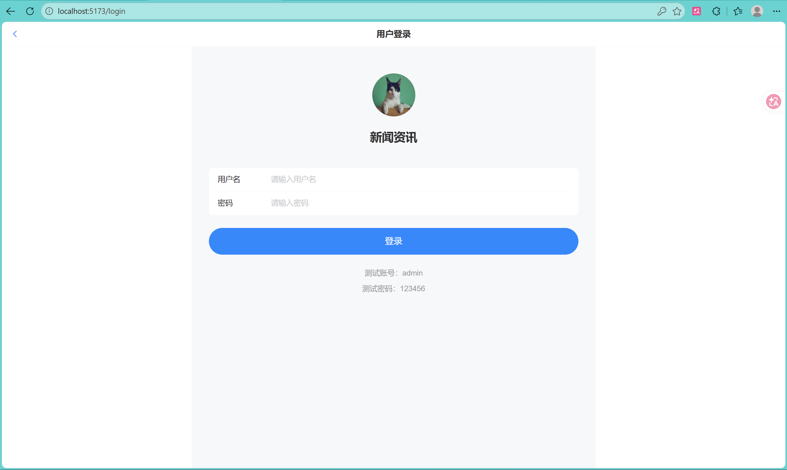
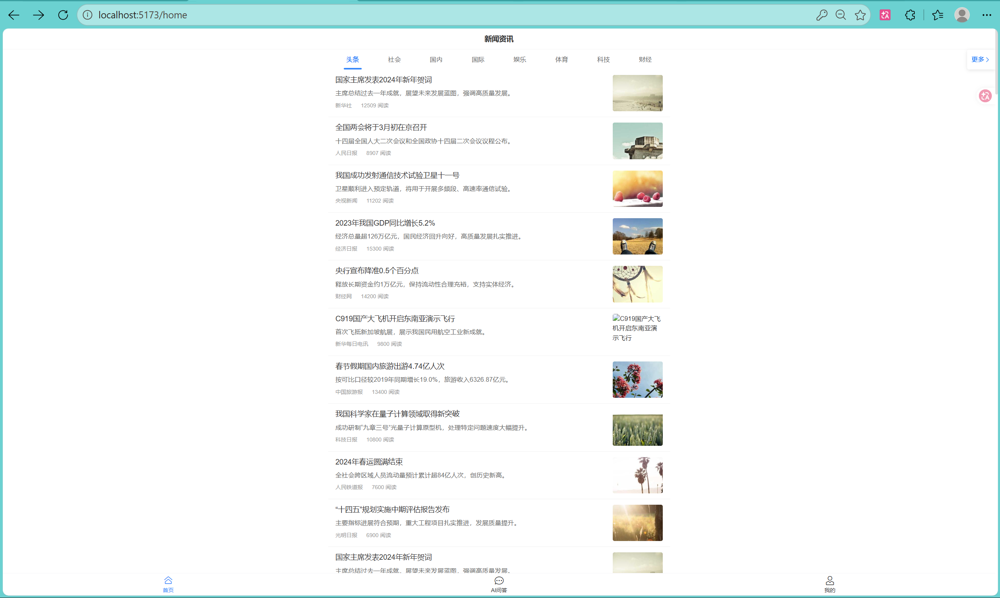
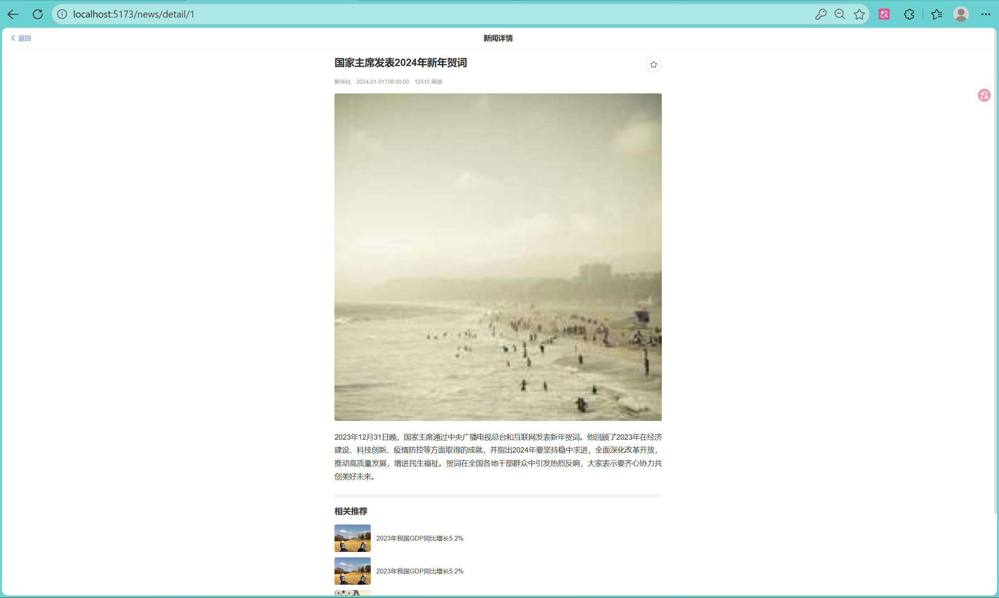
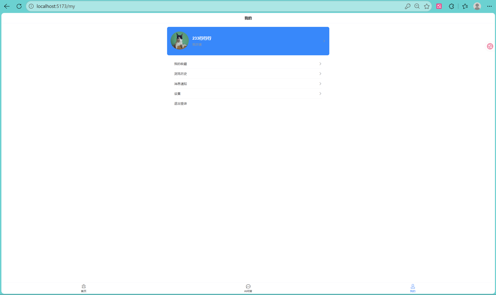
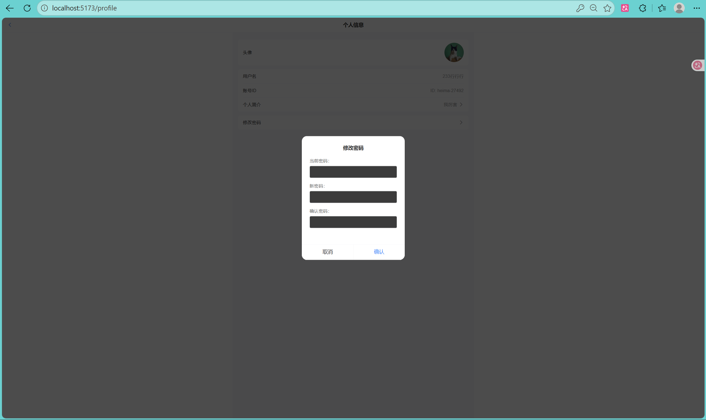
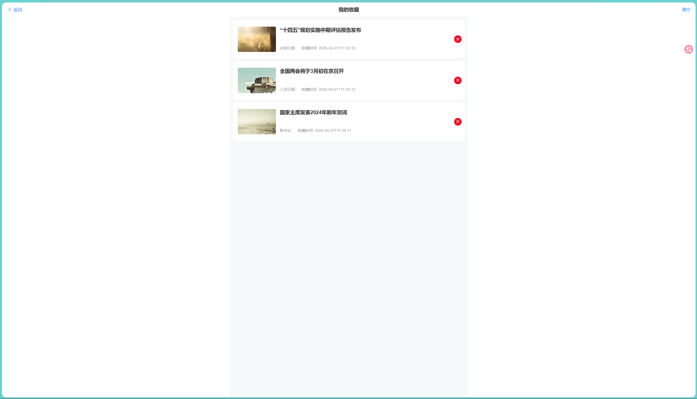
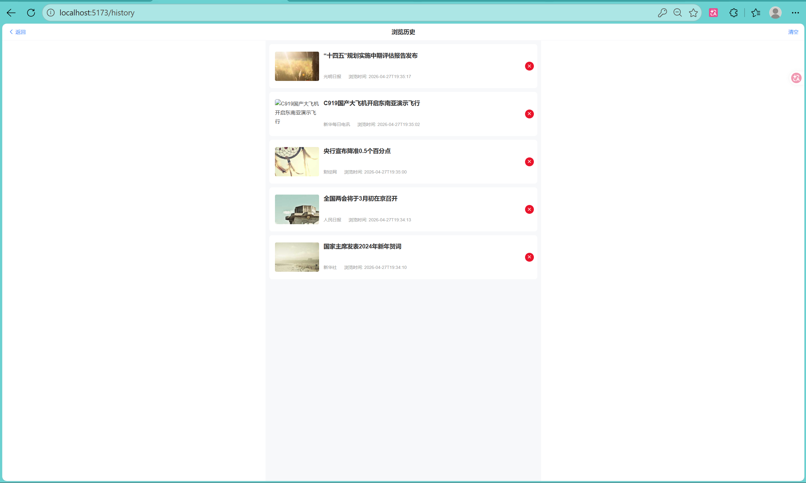

# 🏢 智能新闻管理系统

<div align="center">


</div>
<div align="center">


</div>

✨ 一款基于 FastAPI + Vue 构建的智能新闻管理系统，集成 AI 智能分析能力，支持用户注册登录、新闻增删改查、阅读历史、收藏管理，同时借助通义千问大模型实现新闻摘要生成、关键词提取、情感分析、智能问答等 AI 能力，兼顾性能与智能化体验。

## 📋 功能特性
### 🧑‍💻 核心功能
👤 用户模块：注册、登录、个人信息查询 / 修改，基于 JWT 实现身份认证与权限校验
📰 新闻模块：新闻列表查询、详情查看、新增 / 编辑 / 删除，支持分页、条件筛选
❤️ 收藏模块：新闻收藏 / 取消收藏、收藏列表查询，关联用户与新闻维度
📜 阅读历史：自动记录用户阅读新闻轨迹，支持历史记录查询 / 删除
⚡ 性能优化：热点新闻 Redis 缓存，降低数据库查询压力
### 🤖 AI 智能功能
📝 新闻摘要生成：对单篇 / 多篇新闻自动生成简洁精准的摘要，支持自定义摘要长度
🔑 关键词提取：提取新闻核心关键词，辅助新闻标签化、分类管理
😀 情感分析：分析新闻内容的情感倾向（正面 / 中性 / 负面），输出情感评分
❓ 智能问答：基于新闻知识库，回答用户关于新闻内容、背景、关联信息的自然语言问题
✏️ 内容纠错：自动检测新闻文本中的错别字、语法问题，给出修正建议
### 🛠️ 技术特性
🏗️ 分层架构：严格遵循「配置→模型→校验→CRUD→路由」分层设计，低耦合高内聚
✅ 数据校验：基于 Pydantic 实现请求 / 响应数据校验与序列化，保证数据合法性
📊 统一响应：封装标准化响应格式，简化前端对接逻辑
📚 日志体系：完善的日志记录，支持问题排查与行为审计
🖥️ 前后端同仓：内置 Vue 前端项目目录，支持一体化管理与部署
🔌 AI 接口封装：统一封装通义千问 API 调用逻辑，支持重试、限流、异常处理

## 🚀 快速开始
### 📦 环境准备
```bash
# 1. 克隆项目
git clone https://github.com/xxx/NewsMind.git
cd NewsMind

# 2. 创建虚拟环境
python -m venv venv
# 激活环境（Windows）
venv\Scripts\activate
# 激活环境（Linux/Mac）
source venv/bin/activate

# 3. 安装依赖
pip install fastapi uvicorn sqlalchemy pydantic redis python-jose passlib python-multipart requests python-dotenv

# 4. 初始化数据库
mysql -u root -p < database.sql

# 5. 配置敏感信息
在前端代码news-vue/src/config/api.js中，填写在阿里云百炼申请的api key
```

### ▶️ 启动服务
```bash
# 在终端启动后端Fastapi
uvicorn main:app --reload --host 0.0.0.0 --port 8000

# 在文件夹news-vue启动前端
cd news-vue
npm install
npm run dev
```

###  ✅ 项目展示
登录与注册

新闻分类与列表

新闻详情与推荐

个人信息

修改密码

收藏

浏览历史


### 🔍 接口调试
📖 自动生成的 Swagger 文档：http://localhost:8000/docs 
📋 ReDoc 文档：http://localhost:8000/redoc 
💻 本地调试可直接使用 test_main.http 文件（PyCharm/VSCode 均支持）


## 📁 项目结构
```
news-Fastapi/
├── .idea/                    # IDE（PyCharm）配置目录
│   ├── .gitignore            # IDE目录内的忽略规则
│   ├── dataSources.xml       # 数据源配置
│   ├── db-forest-config.xml  # 数据库可视化配置
│   ├── inspectionProfiles/   # 代码检查配置
│   ├── misc.xml              # 杂项配置
│   ├── modules.xml           # 模块配置
│   ├── sqldialects.xml       # SQL方言配置
│   └── 我的fastapi.iml       # 项目模块配置
├── __pycache__/              # 全局编译缓存目录
│   └── main.cpython-313.pyc  # main.py编译后的字节码文件
├── cache/                    # 缓存逻辑目录
│   └── __pycache__/          # 缓存模块编译缓存
├── config/                   # 项目配置目录
│   ├── __pycache__/          # 配置模块编译缓存
│   ├── cache_conf.py         # 缓存（Redis）配置
│   └── db_conf.py            # 数据库配置
├── crud/                     # 数据操作层（CRUD）
│   ├── __pycache__/          # CRUD模块编译缓存
│   ├── base.py               # 基础CRUD封装
│   ├── favorite.py           # 收藏功能数据操作
│   ├── history.py            # 浏览历史数据操作
│   ├── news.py               # 新闻核心数据操作
│   ├── news_cache.py         # 新闻缓存交互逻辑
│   └── users.py              # 用户数据操作
├── images/                   # 项目截图资源目录
│   ├── .gitkeep
│   ├── 个人信息修改.png
│   ├── 收藏.png
│   ├── 新闻列表.png
│   ├── 新闻详情与推荐.png
│   ├── 浏览历史.png
│   ├── 用户登录与个人信息.png
│   └── 登录与注册.png
├── models/                   # 数据库ORM模型目录
│   ├── __pycache__/          # 模型模块编译缓存
│   ├── favorite.py           # 收藏表模型
│   ├── history.py            # 阅读历史表模型
│   ├── news.py               # 新闻表模型
│   └── users.py              # 用户表模型
├── news-vue/                 # 前端Vue项目目录
│   ├── package.json          # Vue依赖配置
│   ├── vite.config.js        # Vite构建配置
│   ├── public/               # Vue静态资源目录
│   └── src/                  # Vue源码目录
│       ├── main.js           # Vue入口文件
│       ├── api/              # 前端接口请求封装
│       ├── components/       # 公共组件
│       ├── views/            # 页面视图
│       ├── router/           # 前端路由
│       └── store/            # 状态管理
├── routers/                  # 接口路由层目录
│   ├── __pycache__/          # 路由模块编译缓存
│   ├── favorite.py           # 收藏功能接口
│   ├── history.py            # 浏览历史接口
│   ├── news.py               # 新闻核心接口
│   └── users.py              # 用户相关接口
├── schemas/                  # Pydantic数据校验/序列化目录
│   ├── __pycache__/          # 序列化模块编译缓存
│   ├── base.py               # 基础Schema（分页/通用响应）
│   ├── favorite.py           # 收藏相关Schema
│   ├── history.py            # 阅读历史相关Schema
│   ├── news.py               # 新闻相关Schema
│   └── users.py              # 用户相关Schema
├── utils/                    # 工具函数目录
│   ├── __pycache__/          # 工具模块编译缓存
│   ├── auth.py               # 认证工具（JWT生成/验证）
│   ├── response.py           # 统一响应格式封装
│   ├── logger.py             # 日志工具配置
│   └── common.py             # 通用工具（时间/分页等）
├── .gitignore                # Git忽略规则配置
├── LICENSE                   # 项目开源许可证
├── README.md                 # 项目说明文档（内容：# news-Fastapi）
├── database.sql              # 数据库初始化SQL脚本
├── main.py                   # FastAPI项目入口文件
└── test_main.http            # HTTP接口测试脚本
```


## 🧩 核心流程
1. 🔄 接口请求处理流程
```plaintext
前端请求 → 路由层（routers/）接收 → Schema 校验请求参数 → 业务逻辑层（CRUD/AI）处理 → 统一响应格式返回
```
2. 🔐 用户认证流程
```plaintext
用户登录 → 验证账号密码 → 生成 JWT Token → 前端存储 Token → 后续请求携带 Token → 后端解析验证 Token 合法性
```
3. ⚡ 新闻缓存流程
```plaintext
查询新闻列表/详情 → 先查 Redis 缓存 → 缓存命中直接返回 → 缓存未命中 → 查询数据库 → 写入缓存 → 返回数据
```
4. 🤖 AI 功能调用流程
```plaintext
前端发起AI请求（如生成摘要）→ AI路由层接收 → 校验新闻ID/文本参数 → 查AI结果缓存 → 缓存命中直接返回 → 缓存未命中 → 调用AI模块封装的通义千问API → 解析返回结果 → 写入AI缓存 + 记录AI操作日志 → 返回标准化结果
```
5. ❓ 智能问答流程
```plaintext
用户输入问题 → 前端提交问题+关联新闻ID → 后端检索对应新闻内容 → 构造通义千问Prompt（问题+新闻上下文）→ 调用大模型API → 解析回答结果 → 返回给前端
```


## ⚠️ 注意事项
📦 环境依赖：确保 Python 版本 ≥ 3.10，Redis 服务正常运行，数据库账号具备建表 / 读写权限；   
⚡ 缓存策略：新闻新增 / 修改 / 删除后需清理对应新闻缓存和 AI 结果缓存，避免数据不一致；  
🚦 AI API 限流：通义千问 API 有调用频率 / 额度限制，需在 ai/base.py 中配置限流、重试机制，避免触发风控；  
📚 日志配置：生产环境建议将日志输出到文件，并配置日志轮转，重点记录 AI API 调用、异常信息；  
🛡️ 权限控制：当前基础版本仅实现登录认证，生产环境需补充角色权限；  
🌐 前端跨域：若前后端分离部署，需在 FastAPI 中配置跨域允许列表，避免跨域问题；  
💾 数据备份：定期备份 database.sql 及数据库数据，AI 操作记录建议保留，便于排查问题；  
📦 编译缓存：__pycache__ 目录为自动生成，无需手动维护，已加入 .gitignore 忽略。  


<div align="center">
<p>Powered by LiXingZhao</p>
<p>📧 联系我: lixingzhao_lxz@163.com
</div>
